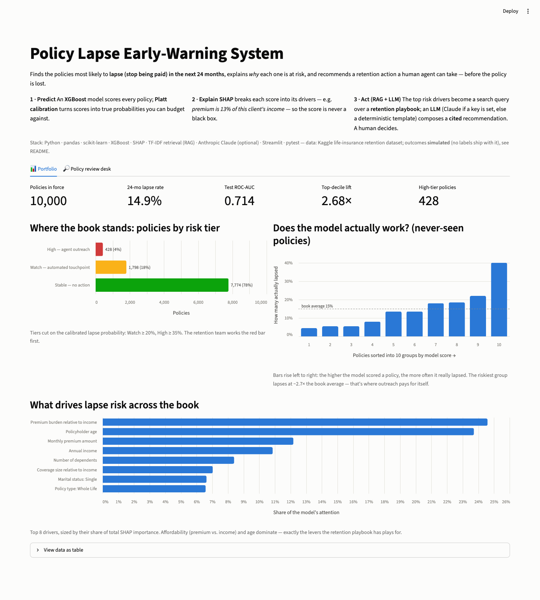
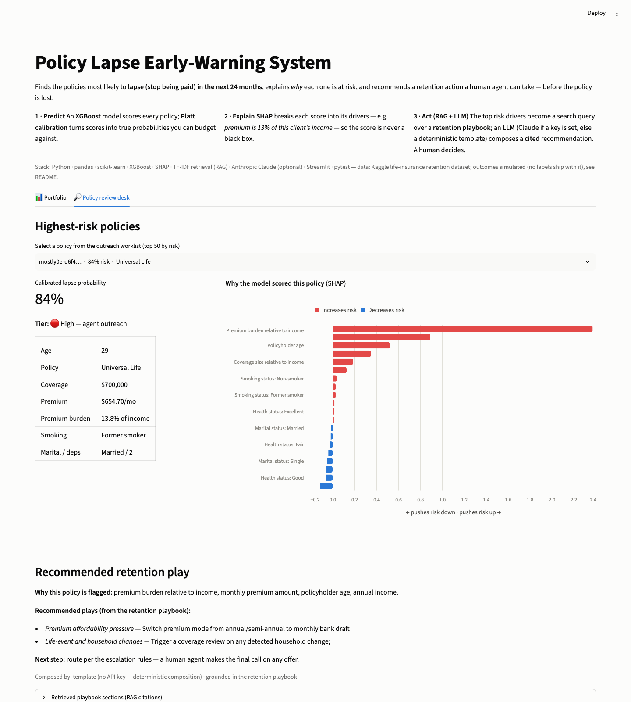
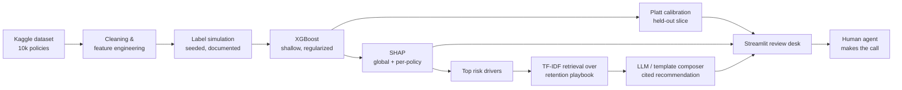

# Policy Lapse Early-Warning System

An end-to-end demo of how a life insurer can find at-risk policies **before**
they lapse and route them to the right retention play - combining a calibrated
ML model, SHAP explanations, and a retrieval-augmented (RAG) retention
playbook, served through a Streamlit review desk.

**Why lapse?** For a mutual life insurer, persistency is the business. Every
lapsed policy is lost future premium, an unrecovered acquisition cost, and a
family that loses coverage - often the ones who needed it most. A model that
concentrates retention outreach on the riskiest decile turns a blanket
campaign into a targeted one.

| Portfolio view | Policy review desk |
|---|---|
|  |  |

## Architecture



## Quickstart

```bash
python3 -m venv .venv && source .venv/bin/activate
pip install -r requirements.txt
make train    # downloads the Kaggle dataset (no account needed), trains, writes artifacts/
make app      # opens the Streamlit review desk
make test     # 12 tests: data, labels, model, RAG
```

No API keys or secrets required. If `ANTHROPIC_API_KEY` is set, the RAG layer
composes recommendations with Claude; otherwise it falls back to a
deterministic template that only uses retrieved playbook text - same
retrieval, same citations, zero hallucination risk.

## Results (held-out test set, seed 42)

| Metric | Value |
|---|---|
| Policies | 10,000 (60/20/20 train / calibration / test) |
| Base 24-month lapse rate | 14.9% |
| ROC-AUC | **0.714** |
| PR-AUC | 0.342 |
| Brier score (calibrated) | 0.115 |
| Top-decile lift | **2.68×** |

Read: the riskiest 10% of the book lapses at ~2.7× the base rate, so a
retention team working only that decile reaches a large share of future
lapses with a tenth of the outreach budget.

## Honest limitations (read this first)

- **The outcome label is simulated.** The Kaggle dataset is label-agnostic, so
  `src/lapse/labels.py` generates lapse outcomes from an actuarially-inspired
  logistic process (premium burden, product type, age, smoking, household -
  directions follow SOA persistency-study findings) plus a large
  unobserved-noise term. The AUC of ~0.71 is therefore *by construction*
  realistically imperfect - real lapse models on real experience data land in
  a similar band. In production this label comes from policy-admin systems,
  and the entire simulator file is deleted.
- Because the simulator sees (a subset of) the model's features, this project
  demonstrates the **pipeline and decision system**, not a scientific claim
  about what drives lapse.
- Occupation sector shows near-zero SHAP importance - correctly, since the
  simulator doesn't use it. It's included to demonstrate messy free-text
  cleaning (~6,000 distinct values with typos → keyword-mapped sectors).
- TF-IDF retrieval is deliberate at this corpus size (one playbook); the
  `Retriever` interface is what a vector store (embeddings) would also
  implement, so the swap is contained.

## Design decisions

- **Calibration is separated from ranking.** XGBoost ranks well but its raw
  scores aren't probabilities a retention team can budget against; a Platt
  (sigmoid) layer fitted on a held-out slice fixes that (Brier 0.115) -
  chosen over isotonic because it never saturates to a "100% will lapse"
  claim in front of a human. The raw model is kept for SHAP; the calibrator
  wraps it at serving time.
- **Explanations feed the RAG query.** Each policy's top risk-*increasing*
  SHAP drivers become the retrieval query against the playbook - the
  recommendation is grounded in both *this policy's* risk profile and approved
  guidance, with sections cited in the UI.
- **Human-in-the-loop by design.** Calibrated probability maps to three tiers
  (stable / watch / high); high-tier policies route to an agent, hardship
  mentions escalate to a licensed specialist, and no offer is ever automated.
- **Tests cover behavior, not coverage.** Determinism of the simulator,
  direction of the premium-burden effect, grounding of RAG output, and an
  end-to-end train that must beat chance on a fresh synthetic book.

## Project layout

```
├── app.py                     # Streamlit review desk (portfolio + policy views)
├── knowledge/
│   └── retention_playbook.md  # RAG corpus: interventions by risk driver
├── src/lapse/
│   ├── config.py              # paths, seed, tier thresholds
│   ├── data.py                # Kaggle load, cleaning, affordability features
│   ├── labels.py              # documented lapse simulator (see limitations)
│   ├── features.py            # encoder + XGBoost pipeline
│   ├── train.py               # split → fit → calibrate → evaluate → artifacts
│   ├── explain.py             # SHAP values, driver labels, risk tiers
│   └── rag.py                 # retriever + LLM protocol + advisor
└── tests/                     # 12 behavioral tests (no network needed)
```

## What I'd build next for production

1. **Real labels & time discipline** - policy-admin lapse events, point-in-time
   feature snapshots, out-of-time validation instead of a random split.
2. **MLOps** - experiment tracking, model registry, scheduled retraining and
   drift monitoring (PSI on features, calibration decay on scores), CI running
   this test suite.
3. **Uplift, not risk** - the business question is "who is *persuadable*", not
   "who will lapse"; an uplift model on intervention logs is the v2.
4. **Embedding retrieval + evaluators** - swap TF-IDF for a vector store and
   add an LLM-as-judge harness scoring groundedness of recommendations before
   any agent sees them.
5. **Serving** - batch scoring into the CRM worklist via API, with the
   Streamlit app kept as the analyst-facing review surface.
